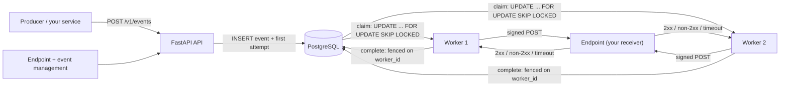
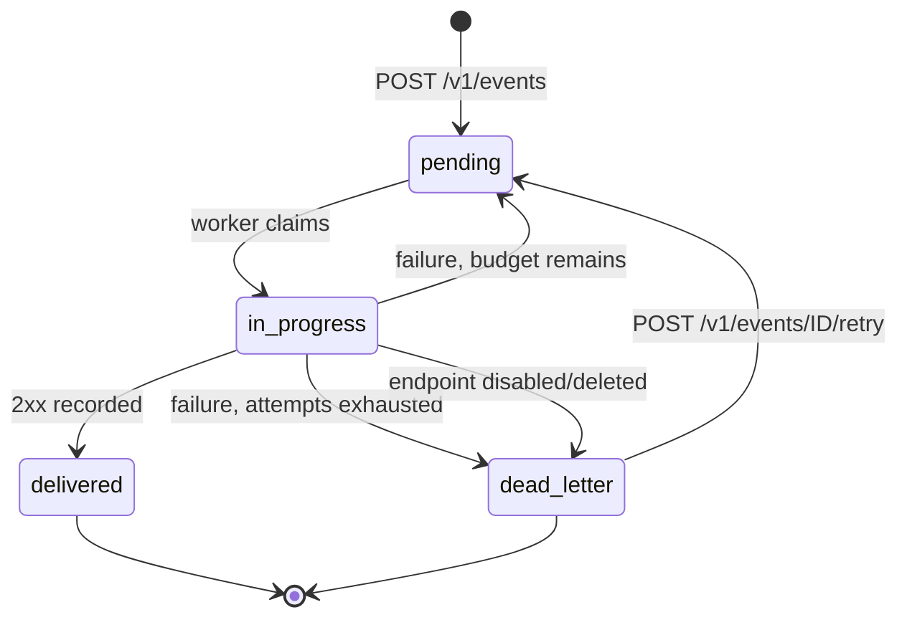
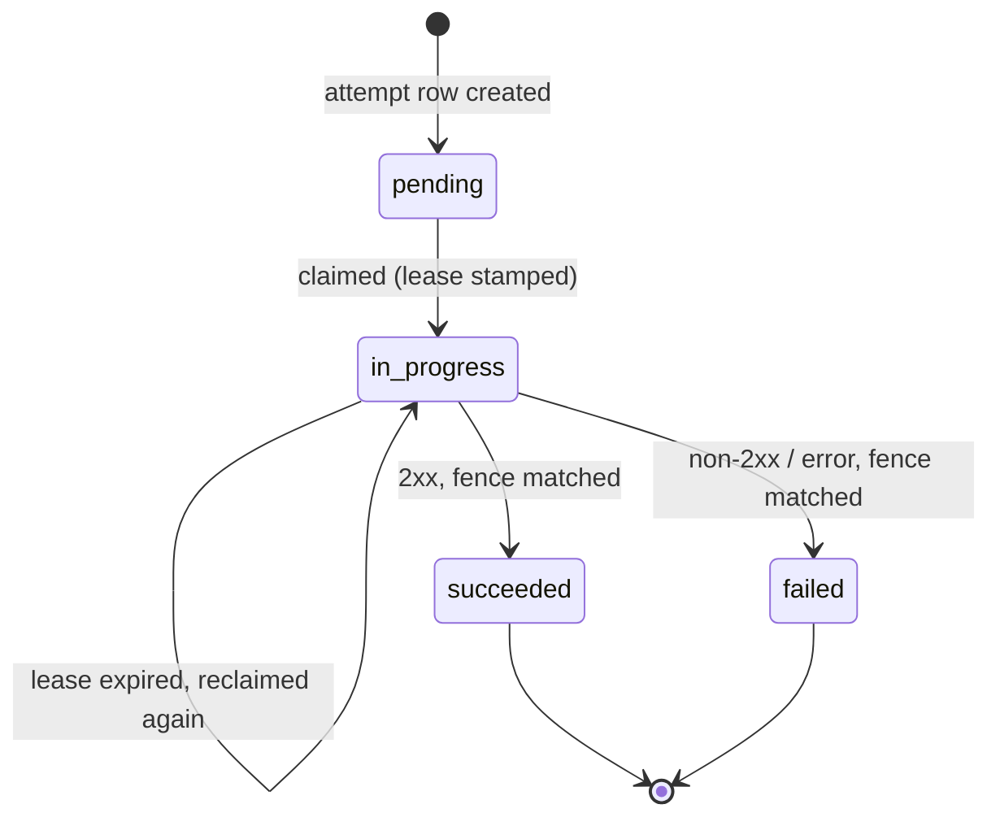

# Architecture

This document explains how the platform works, why it is built this way, and
where the sharp edges are. For the HTTP surface see [api.md](api.md); for the
wire format and how to run things see the [README](../README.md).

## Goals

- **Don't lose events.** Once `POST /v1/events` returns `201`, the event is in
  PostgreSQL and will be retried until it is delivered or dead-lettered.
- **At-least-once delivery.** Retries and crash recovery can produce duplicate
  deliveries; consumers deduplicate on `X-Webhook-Id`.
- **Safe horizontal scaling.** Run any number of workers against one database;
  work is claimed atomically and completions are fenced.
- **Few moving parts.** PostgreSQL is the datastore *and* the queue. There is no
  Redis, no message broker, no scheduler process.

## Components

| Component | What it is | Scaling unit |
| --------- | ---------- | ------------ |
| **API** (`webhooks-api`) | FastAPI app: registers endpoints, submits events, lists/inspects events, retries, health probes. Stateless; one async SQLAlchemy pool. | Replicas behind a load balancer. |
| **Worker** (`webhooks-worker`) | Long-running loop that claims attempts, POSTs them to endpoints with an HMAC signature, and records the outcome. Stateless besides in-flight requests. | Replicas; each needs a unique `WORKER_ID`. |
| **PostgreSQL** | Stores endpoints, events and delivery attempts. The `delivery_attempts` table *is* the queue. | One primary (the write path); no replicas required. |
| **Reference receiver** (`webhooks-receiver`) | Test-only FastAPI app implementing the documented wire contract, with control endpoints to program failures. Included in the verify override. | Not for production. |



## Data model

Three tables carry the whole state machine (`src/webhooks/models.py`,
`migrations/versions/95b6f8f3a63b_initial_schema.py`).

### `webhook_endpoints`

Destination registry. `name`, `url` (checked `~ '^https?://'`), `secret` (HMAC
key, 32 random bytes as URL-safe base64), `state` (`active` | `disabled` |
`deleted`), `deleted_at`, `created_at`, `updated_at`. Deleting is a soft delete
so delivery history stays inspectable; new events to a disabled or deleted
endpoint are rejected with `409`.

### `events`

One row per submitted event: `endpoint_id`, `event_type`, `payload` (JSONB),
`idempotency_key`, `status`, `attempt_count`, `max_attempts`, `next_attempt_at`,
`last_error`, `delivered_at`, `dead_lettered_at`, timestamps.

- `UNIQUE (endpoint_id, idempotency_key)` — per-endpoint idempotency. `NULL` keys
  are always distinct in PostgreSQL, so keyless submissions are never deduped.
- Check constraints on `status`, `max_attempts >= 1`, `attempt_count >= 0`.
- Indexes: `(status, created_at)` and `(endpoint_id, created_at)` for listing.

### `delivery_attempts`

The queue. One row per delivery try: `event_id`, `attempt_number`, `state`,
`scheduled_at`, `started_at`, `finished_at`, `lease_expires_at`, `worker_id`,
`recoveries`, and diagnostics (`response_status`, `response_snippet`, `error`,
`duration_ms`).

Partial indexes make the hot paths cheap:

- `UNIQUE (event_id) WHERE state IN ('pending','in_progress')` — at most one
  claimable attempt per event, so a retry can never fork an event into two live
  jobs.
- `(scheduled_at) WHERE state = 'pending'` — the due-work scan.
- `(lease_expires_at) WHERE state = 'in_progress'` — the crash-recovery scan.

Constraints tie the invariant to the schema: an `in_progress` attempt must have a
`lease_expires_at` and `worker_id`, and a terminal attempt must have
`finished_at`.

## The delivery pipeline

1. **Submit.** `POST /v1/events` loads the endpoint (404 if unknown, 409 if
   disabled/deleted), `INSERT`s the event and its first attempt in one nested
   transaction, then commits. `attempt_count` starts at 1 and `next_attempt_at`
   is set from the *database clock*, so scheduling never depends on host clocks.
2. **Claim.** A worker runs one SQL statement that atomically selects up to
   `WORKER_BATCH_SIZE` due-or-expired attempts and flips them to `in_progress`:

   ```sql
   UPDATE delivery_attempts AS a
      SET state = 'in_progress',
          worker_id = :worker_id,
          lease_expires_at = now() + make_interval(secs => :lease_seconds),
          started_at = now(),
          recoveries = a.recoveries
                     + CASE WHEN c.previous_state = 'in_progress' THEN 1 ELSE 0 END
     FROM (
           SELECT id, state AS previous_state
             FROM delivery_attempts
            WHERE (state = 'pending'        AND scheduled_at <= now())
               OR (state = 'in_progress'    AND lease_expires_at <= now())
            ORDER BY scheduled_at, id
            FOR UPDATE SKIP LOCKED
            LIMIT :batch_size
          ) AS c
    WHERE a.id = c.id
   RETURNING a.id AS attempt_id, a.event_id, a.attempt_number, a.recoveries,
             (c.previous_state = 'in_progress') AS recovered
   ```

   `FOR UPDATE SKIP LOCKED` is what makes this safe: concurrent workers never
   block on each other and never select the same row, so two workers cannot both
   win an attempt. The same statement also marks the parent event
   `in_progress`. A second query joins the claimed attempts to their events and
   endpoints to build the `ClaimedAttempt` (URL, secret, payload, attempt number).
3. **Deliver.** The worker POSTs compact canonical JSON with HMAC headers (see
   [README](../README.md#signed-deliveries-wire-format)) under a hard
   `DELIVERY_TIMEOUT_SECONDS` timeout, with `follow_redirects=False`. Any 2xx is
   success; everything else is a failure and is retried.
4. **Complete.** The outcome is written with a **fence**:

   ```sql
   UPDATE delivery_attempts
      SET state = 'succeeded', finished_at = now(), ...
    WHERE id = :attempt_id AND state = 'in_progress' AND worker_id = :worker_id
   RETURNING event_id
   ```

   If the row no longer matches (the lease was reclaimed by another worker), the
   update affects 0 rows, the result is discarded and a warning is logged. On
   success the event becomes `delivered`; on failure the worker either inserts
   the next attempt with a backoff delay or dead-letters the event.

## Event and attempt state machines



An event is `pending` while its next attempt is waiting for its backoff slot, and
`in_progress` while an attempt is claimed. Only `delivered` and `dead_letter` are
terminal.



A lease expiry re-claims the **same** row (incrementing `recoveries`); it does not
create a duplicate attempt. Only a recorded failure inserts a new attempt row.

## Retry scheduling

`BackoffPolicy` (`src/webhooks/backoff.py`) computes the delay before attempt *n*
(1-based):

```
delay = min(BASE * 2^(n-1), MAX)          # exponential, capped
delay += delay * JITTER_RATIO * U(0, 1)   # optional uniform jitter
```

With the defaults (`BASE=2`, `MAX=300`, `JITTER_RATIO=0.2`) the nominal delays
are 2 s, 4 s, 8 s, 16 s, … capped at 5 minutes. Jitter spreads retries when many
events fail at once (e.g. a destination outage) instead of retrying them in
lockstep. `DELIVERY_MAX_ATTEMPTS` bounds attempts per event; when attempt
`attempt_number >= max_attempts` fails, the event is dead-lettered. A manual
retry grants a fresh budget counted from the new attempt number.

## Why PostgreSQL instead of Redis

A Redis (or broker) queue was the obvious alternative, and it is deliberately not
used. The decisive property is **one ACID transaction for claim + state change**:
the claim, the parent-event transition and (later) the completion all live in the
same database as the authoritative event and attempt rows. A broker splits the
system into two sources of truth that must be reconciled.

| Concern | PostgreSQL queue (chosen) | Redis / broker queue |
| ------- | ------------------------- | -------------------- |
| Claim + record state | One `UPDATE ... RETURNING`, atomic, no dual write | Claim in Redis, state in DB; needs reconciliation if either succeeds alone |
| Crash recovery | Falls out of lease expiry (`lease_expires_at <= now()`), scanned via a partial index | Needs a visibility-timeout / pending-entries mechanism plus reclaim logic |
| Ordering & scheduling | `ORDER BY scheduled_at`, backoff delays are just `scheduled_at` values | Delayed jobs need a sorted set or a scheduler, often a second system |
| Backpressure & inspection | The queue is queryable SQL; the DLQ is `WHERE status='dead_letter'` | Ops tooling is broker-specific; payload history lives elsewhere |
| Ops surface | The database you already run, monitor and back up | Another stateful service to run, size, secure and back up |
| Sub-second latency at very high throughput | Polling adds up to `WORKER_POLL_INTERVAL_SECONDS` latency; row locks and index bloat under very high write rates | Native push/`BLPOP` wakes workers instantly; scales further per shard |

**Trade-offs accepted:** workers poll (default every 1 s when idle), so
low-traffic delivery latency is bounded by the poll interval; a single primary
database bounds total claim throughput (fine for the intended scale, and the
claim query is indexed); large payloads live in the database. If a future
workload needs sub-second scheduling or many thousands of jobs per second, the
claim/complete functions in `src/webhooks/service.py` are the seam to replace
with a broker-backed implementation — the event state machine and HTTP contract
would not change.

## Decisions and trade-offs

- **Leases + `worker_id` fencing instead of heartbeat renewal.** A claim stamps
  `lease_expires_at` and the owning `worker_id`; every completion is conditioned
  on both. A worker that stalls past its lease and later finishes simply has its
  write discarded, so a reclaimed attempt can never be clobbered. The cost is
  that recovery waits out the full lease (no live renewal loop), and a genuine
  long-running delivery can be re-claimed concurrently — the receiver may see it
  twice. This buys correctness with far less machinery than heartbeats plus
  ownership election.
- **Attempts are the queue.** Rather than a `status` on the event as the work
  item, each try is a row. That gives an audit trail for free (`GET
  /v1/events/{id}` returns every attempt with its worker, duration and response)
  and makes the DLQ a plain query. The cost is a little more write volume.
- **Partial unique index pins one live attempt per event.** Concurrent submission
  or retry paths cannot fork an event into two simultaneously-claimable jobs; the
  database, not application discipline, enforces it.
- **Soft deletes.** History and auditability beat hard deletes; the price is
  that deleted rows and their secrets linger (see limitations).
- **Database clock for scheduling.** `now()` in SQL is used for lease expiry,
  backoff and claim predicates, so workers with skewed clocks still agree on what
  is due and what has expired.
- **Sign the exact bytes sent.** `json_dumps_compact` (`sort_keys=True`,
  `separators=(",", ":")`, `default=str`) is used both to compute the HMAC and to
  produce the request body, so a receiver verifies the raw body rather than
  reconstructing it. The timestamp is part of the signed string, enabling
  replay-window checks.
- **Secrets returned exactly once.** The create response is the only place a
  secret is serialized; all other representations are built through explicit
  `from_*` builders, so a secret cannot leak by accident. The trade-off is that a
  lost secret must be rotated by re-creating the endpoint (no rotate endpoint).

## Failure modes

| Situation | Behaviour |
| --------- | --------- |
| Worker dies before POSTing | Its attempt stays `in_progress` until `lease_expires_at`, then any worker re-claims it (`recoveries++`) and delivers. |
| Worker dies after POST, before recording | Same recovery; the endpoint may receive the event twice (at-least-once). |
| Worker finishes after lease reclaimed | Completion UPDATE matches 0 rows; the result is discarded and logged (`discarded success/failure for attempt no longer owned`). |
| Recording the outcome raises | The exception is logged; the attempt stays `in_progress` and is recovered by lease expiry. The worker loop never crashes on a single delivery. |
| Endpoint disabled/deleted while an attempt is in flight | The worker marks the attempt failed with `terminal=True`, so the event dead-letters immediately instead of burning the retry budget. |
| Database briefly unreachable | `/readyz` returns 503; a worker iteration logs the error and retries on the next poll. Claims are unaffected once the database returns. |
| Two workers race for one attempt | `FOR UPDATE SKIP LOCKED` gives each a disjoint set; the loser never sees the row. |

## Observability

Logging is configured by `LOG_FORMAT` (`json` default, one object per line).
Records carry structured fields via `extra=`, which the JSON formatter lifts to
the top level: `event_id`, `endpoint_id`, `attempt_id`, `attempt_number`,
`worker_id`, `response_status`, `duration_ms`, `retry_in_seconds`. The reference
receiver and `GET /v1/events/{id}` expose the same attempt-level identifiers, so
a delivery can be traced from submission to final status. `/healthz` is liveness
(never touches the database); `/readyz` checks the database and returns 503 when
it is unreachable.

## Extensibility seams

- **Delivery transport / signing**: `src/webhooks/worker/delivery.py`.
- **Scheduling/backoff**: `src/webhooks/backoff.py`.
- **Queue semantics**: `src/webhooks/service.py` (`claim_attempts`,
  `mark_attempt_succeeded`, `mark_attempt_failed`).
- **Queue backend**: replace the above with a broker-backed implementation behind
  the same signatures; the API, state machine and wire format stay put.
